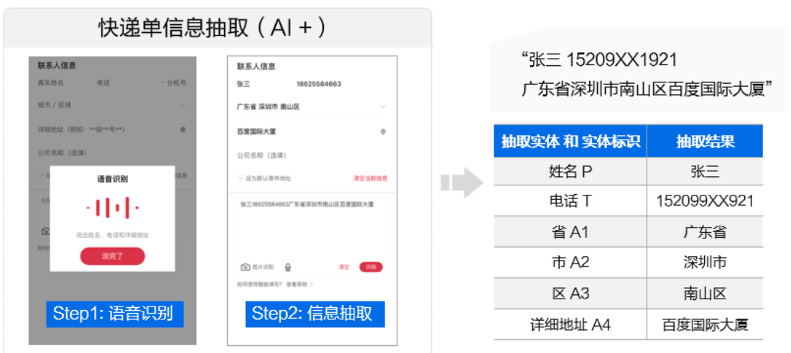

# 物流快递单信息抽取

## 目 录

* [项目概述](#项目概述)
* [安装说明](#安装说明)
* [方案介绍](#方案介绍)
* [数据准备](#数据准备)
* [组网、训练、评估](#模型选择、训练、评估)
* [模型部署](#模型部署)

<a name="项目概述"></a>

## 1  项目概述

本项目主要介绍如何使用飞桨自然语言处理开发库 PaddleNLP 完成物流快递单信息抽取：从用户提供的快递单中，抽取姓名、电话、省、市、区、详细地址等内容，形成结构化信息。辅助物流行业从业者进行有效信息的提取，从而降低客户填单的成本。




从物流信息中抽取想要的关键信息，实际上是NLP中的实体抽取任务。实体信息抽取技术业务难点如下：

* **实体类别多，任务复杂度高**    
同一名词可能对应多个实体类别，如“蜗牛”。    
不少实体词与普通用语相同，尤其作品名。     
此外，实体类别多，任务复杂度较高，如下所示实体示例：


<center>图1：实体示例</center></br>

* **实体词往往稀疏低频**    
人名在语料出现频次高，但不同人名出现频次有限。大多垂类实体词在通用语料出现频次低。

* **特定业务场景中标注数据集较少，需要一定的成本标注，如果数据集质量差或样本量过少，精度会比较低。**  

  

<a name="安装说明"></a>

## 2  安装说明

### 环境要求

* PaddlePaddle >= 2.1.0
* Python >= 3.6
* PaddleNLP >= 2.0.0

### pip安装

```
pip install --upgrade paddlenlp
```

PaddlePaddle 安装可参考[安装文档](https://www.paddlepaddle.org.cn/install/quick?docurl=/documentation/docs/zh/install/pip/linux-pip.html)。


<a name="方案介绍"></a>

## 3  方案介绍

### 3.1 序列标注

针对实体信息抽取技术，有如下三种方案：

- **符号主义 —— 字符串匹配**
  需要构建词典，穷举所有地址、姓名等信息，但无法发现新词、简称等。
- **统计语言模型（Word-Based Generative Model）- n-gram概率/最大概率路径**
  需要构建词典及词频，仍无法发现新词、简称等。
- **序列标注（Character-Based Discriminative Model）**
  需要标注数据，效果好，可发现新词、简称。 有两类实现方法：一是基于统计的模型：HMM、MEMM、CRF，这类方法需要关注特征工程；二是深度学习方法：RNN、LSTM、GRU、CRF、RNN+CRF....

本案例采用序列标注的方式，更加灵活、通用。

在序列标注任务中，我们首先要定义好需要抽取哪些字段。比如现在拿到一个快递单，可以作为我们的模型输入，例如“张三18625584663广东省深圳市南山区学府路东百度国际大厦”，那么序列标注模型的目的就是识别出其中的“张三”为人名（用符号 P 表示），“18625584663”为电话名（用符号 T 表示），“广东省深圳市南山区百度国际大厦”分别是 1-4 级的地址（分别用 A1~A4 表示，可以释义为省、市、区、街道）。

这是一个典型的命名实体识别（Named Entity Recognition，NER）场景，各实体类型及相应符号表示见下表：


<center>图2：快递单实体类型 </center></br>

针对需要被抽取的“姓名、电话、省、市、区、详细地址”等实体，我们采用BIO标注体系，标签集合可以定义为：label = {P-B, P-I, T-B, T-I, A1-B, A1-I, A2-B, A2-I, A3-B, A3-I, A4-B, A4-I, O}。每个标签的定义分别为：


<center>图3：标签体系 </center></br>

采用以上标注体系，对于句子“张三18625584663广东省深圳市南山区百度国际大厦”，每个汉字及对应标签如下，其中“张“，”三”在这里表示成了“P-B” 和 “P-I”，“P-B”和“P-I”合并成“P” 这个标签。这样重新组合后可以得到最终的信息抽取结果：


<center>图4：数据集标注示例 </center></br>

### 3.2 模型选择

#### 3.2.1 循环神经网络 - 门控循环单元（GRU，Gate Recurrent Unit）

BIGRU是一种经典的循环神经网络（RNN，Recurrent Neural Network），用于对句子等序列信息进行建模。这里我们重点解释下其概念和相关原理。一个 RNN 的示意图如下所示，


<center>图5：RNN示意图 </center></br>

左边是原始的 RNN，可以看到绿色的点代码输入 x，红色的点代表输出 y，中间的蓝色是 RNN 模型部分。橙色的箭头由自身指向自身，表示 RNN 的输入来自于上时刻的输出，这也是为什么名字中带有循环（Recurrent）这个词。

右边是按照时间序列展开的示意图，注意到蓝色的 RNN 模块是同一个，只不过在不同的时刻复用了。这时候能够清晰地表示序列标注模型的输入输出。

GRU是为了解决长期记忆和反向传播中梯度问题而提出来的，和LSTM一样能够有效对长序列建模，且GRU训练效率更高。

#### 3.2.2 条件随机场（CRF，Conditional Random Fields)

长句子的问题解决了，序列标注任务的另外一个问题也亟待解决，即标签之间的依赖性。举个例子，我们预测的标签一般不会出现 P-B，T-I 并列的情况，因为这样的标签不合理，也无法解析。无论是 RNN 还是 LSTM 都只能尽量不出现，却无法从原理上避免这个问题。下面要提到的条件随机场 CRF 却很好的解决了这个问题。

条件随机场属于概率图模型中的无向图模型，这里我们不做展开，只直观解释下该模型背后考量的思想。一个经典的链式 CRF 如下图所示，


<center>图6：CRF示意图 </center></br>

CRF 本质是一个无向图，其中绿色点表示输入，红色点表示输出。点与点之间的边可以分成两类，一类是 x 与 y 之间的连线，表示其相关性；另一类是相邻时刻的 y之间的相关性。也就是说，在预测某时刻 y 时，同时要考虑相邻的标签。当 CRF 模型收敛时，就会学到类似 P-B 和 T-I 作为相邻标签的概率非常低。

#### 3.2.3 预训练模型 （ERNIE、ERNIE-Gram）

除了GRU+CRF方案外，我们也可以使用预训练模型，将序列信息抽取问题，建模成字符级分类问题。这里我们采用强大的语义模型ERNIE，完成字符级分类任务。使用预训练模型往往比RNN网络能获得更高的模型精度，但从部署上看，预训练模型参数较多，预测性能可能不符合线上快速相应需求，可以结合模型压缩、FasterTransformer加速等方式进行高性能部署。


<center>图7：ERNIE示意图 </center></br>

### 3.3 评估指标

信息抽取的通用评测指标：Precision、Recall、F1值。
例如：希望抽取10个信息，实际抽取12个，其中有9个是对的：


<a name="数据准备"></a>

##  4  数据准备

这里采取的是快递单数据集，包括1600条训练集，验证集和测试集各200条。这份数据除姓名、人名、地名之外，无其他信息。采用BIO方式标注训练集，由于仅含实体信息，所以数据集无“O”（非实体）标识。训练集中除第一行是 `text_a\tlabel`，后面的每行数据都是由两列组成，以制表符分隔，第一列是 utf-8 编码的中文文本，以 `\002` 分割，第二列是对应序列标注的结果，以 `\002` 分割。

最终数据集文件组织结构为：

```
 ├── dataset
  ├── train.txt
  └── dev.txt
  └── test.txt
```

此外还需要标签文件:

```
 ├── conf
  ├── tag.dic
```


<a name="模型选择、训练、评估"></a>

##  5  组网、训练、评估

PaddleNLP中提供了一系列模型，均可简便调用。预训练模型的使用方法可参考[官方文档](https://paddlenlp.readthedocs.io/zh/latest/model_zoo/transformers.html)。

* BiGRU + CRF

```python
python run_bigru_crf.py
```

* ERNIE 1.0

```python
python run_ernie.py
```

* ERNIE 1.0 + CRF

```python
python run_ernie_crf.py
```

* ERNIE-Gram

```python
python run_erniegram.py
```

* ERNIE-Gram + CRF

```python
python run_erniegram_crf.py
```

最终，ERNIE-Gram、ERNIE-Gram+CRF模型取得了最佳效果。由于这份数据集的标注质量非常高，所以模型间效果的差别不是很大。在实际工业中的数据集上，ERNIE-Gram更能发挥出绝对领先的优势。

| 模型             | Precision | Precision | F1    |
| ---------------- | --------- | --------- | ----- |
| ERNIE-Gram + CRF | 0.987     | 0.991     | 0.989 |

<a name="模型部署"></a>

## 6  模型部署

在模型训练过程中保存的模型文件包含前向预测和反向传播的过程，在实际的工业部署则不需要反向传播，因此需要将模型导成部署需要的模型格式。我们推荐在动态图模式下开发，训练完成后再导出静态图模型，进行部署， 可参考[PaddleNLP模型导出](https://github.com/PaddlePaddle/PaddleNLP/blob/develop/examples/information_extraction/waybill_ie/export_model.py)示例。

